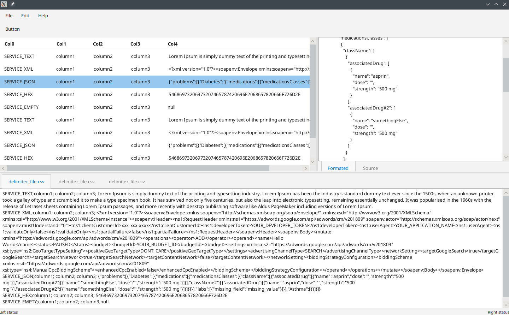

# viewerfx
Java FX Viewer

# Description
* I am ViewerFX
* I am Java and JavaFx App
* I am not specific tool but more like tool framework
* I am very ugly prototype - do not judge my code - my developer is learning JavaFX

# Motivation
* I need base platform for different data file formats.
* I need be able open multiple file formats with lot of different records
* I need to be able visualize parsed records in list for filter/sort
* I need to be able show main part of record in Raw/Formatted or custom view.

# Features
* drag and drop file into app will load the file
* CDI for plugin mechanism - I don't like discover via classpath
     * discover custom view per record type
     * discover custom formatters per record type
     * discover custom parsers
* parsers
     * delimiter file like CSV
* formatters
     * xml formatter
     * json formatter 
* views
    * xml tree view with/out compact mode
    * tree view for json file

# TODO
* tool data model need rework
* time to onboard some design patterns
* CDI for plugin mechanism from other libs
     * events
     * producers
* configuration
    * general for tool
    * possibility load plugin config
* select event - select anything in any view should propagate and select in other view - tricky one
    * looks like work for javafx events or CDI events
* search and mark interested records
* table view
     * show/hide columns in table
     * filter table records
     * sort table records
* formatters
     * nothing planned except make them more effecient
* views
     * general map view as key value 
* parsers
     * regex based parser
     * log4j format parser

